## Assignemnt - 03 [2025]

The goal of this assignemnt is to create a simple training pipeline, use mlflow to track experiments and register best model, but use Prefect for it.

We'll use [the same NYC taxi dataset](https://www1.nyc.gov/site/tlc/about/tlc-trip-record-data.page), the **Yellow** taxi data for March, 2023. 

## Question 1. Select the Tool

You can use the same tool you used when completing the module,
or choose a different one for your assignment.

What's the name of the orchestrator you chose? 

 ### Answer : Prefect

 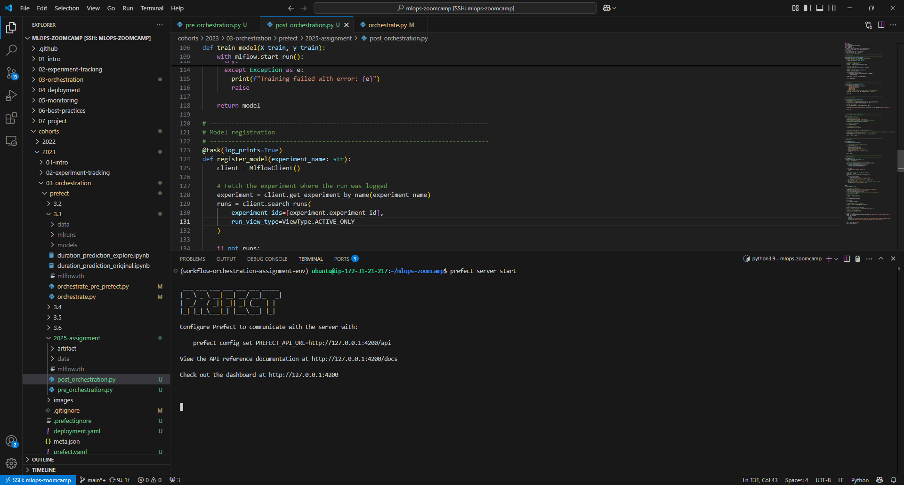

## Question 2. Version

What's the version of the orchestrator? 

 ### Answer: 3.4.5 ###

 

## Question 3. Creating a pipeline

Let's read the March 2023 Yellow taxi trips data.

How many records did we load? 

- 3,003,766
- 3,203,766
- 3,403,766
- 3,603,766

(Include a print statement in your code)

 ### Answer: 3,403,766 ###

## Question 4. Data preparation

Let's continue with pipeline creation.

We will use the same logic for preparing the data we used previously. 

This is what we used (adjusted for yellow dataset):

```python
def read_dataframe(filename):
    df = pd.read_parquet(filename)

    df['duration'] = df.tpep_dropoff_datetime - df.tpep_pickup_datetime
    df.duration = df.duration.dt.total_seconds() / 60

    df = df[(df.duration >= 1) & (df.duration <= 60)]

    categorical = ['PULocationID', 'DOLocationID']
    df[categorical] = df[categorical].astype(str)
    
    return df
```

Let's apply to the data we loaded in question 3. 

What's the size of the result? 

- 2,903,766
- 3,103,766
- 3,316,216 
- 3,503,766

 ### Answer : 3,316,216 ###

## Question 5. Train a model

We will now train a linear regression model using the same code as in homework 1.

* Fit a dict vectorizer.
* Train a linear regression with default parameters.
* Use pick up and drop off locations separately, don't create a combination feature.

Let's now use it in the pipeline. We will need to create another transformation block, and return both the dict vectorizer and the model.

What's the intercept of the model? 

Hint: print the `intercept_` field in the code block

- 21.77
- 24.77
- 27.77
- 31.77

 ### Answer: 24.77 ###

 |                                                  |                                                        |
 |--------------------------------------------------|--------------------------------------------------------|
 |  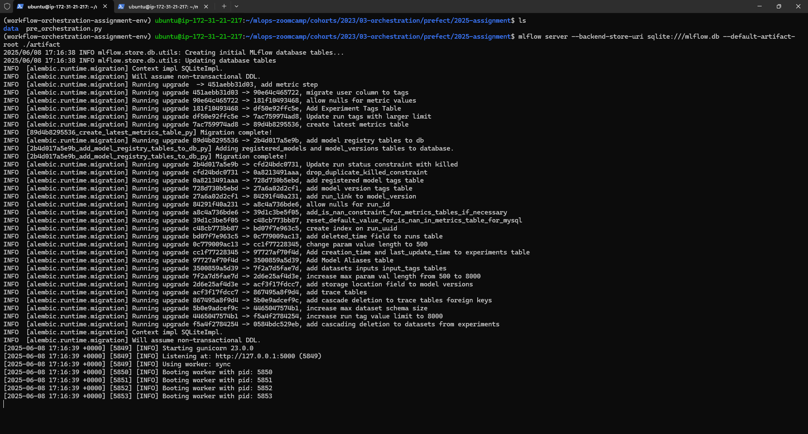     |     | 


 |                                                       |                                                        |
 |-------------------------------------------------------|--------------------------------------------------------|
 |  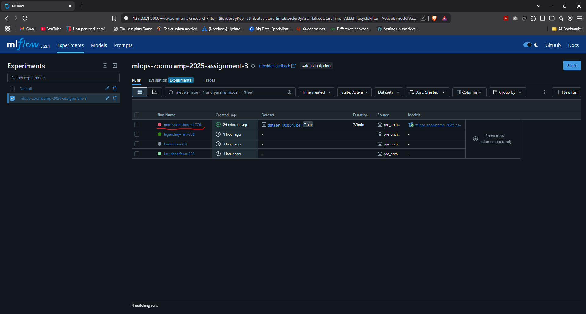 | 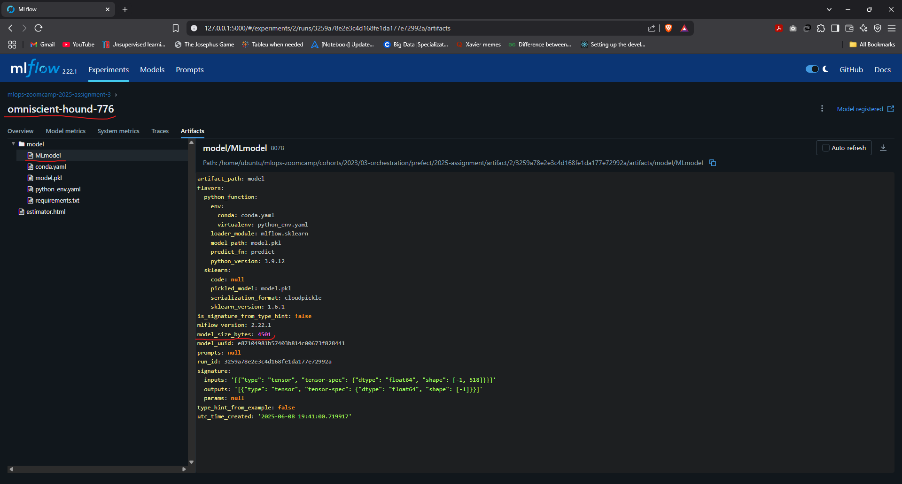  |


## Question 6. Register the model 

The model is trained, so let's save it with MLFlow.

Find the logged model, and find MLModel file. What's the size of the model? (`model_size_bytes` field):

* 14,534
* 9,534
* 4,534
* 1,534

 ### Answer: 4,534 ###

 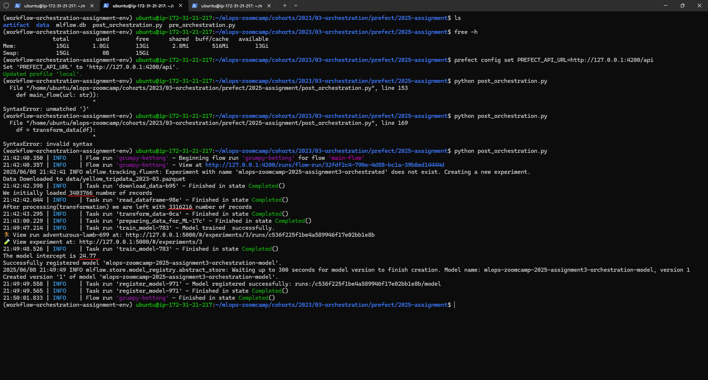


 |                                                           |                                                        |
 |-----------------------------------------------------------|--------------------------------------------------------|
 |    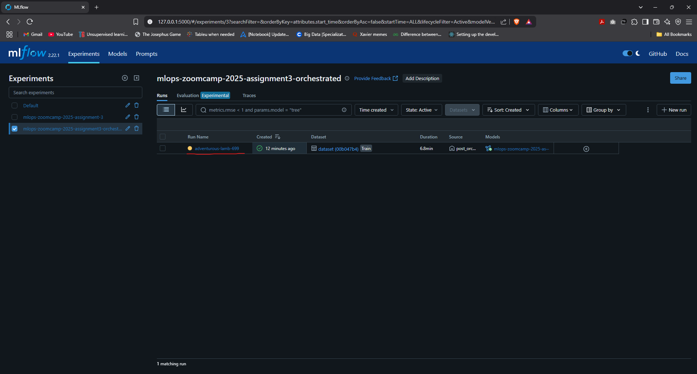   |   | 


 |                                       |                                      |
 |---------------------------------------|--------------------------------------|
 |  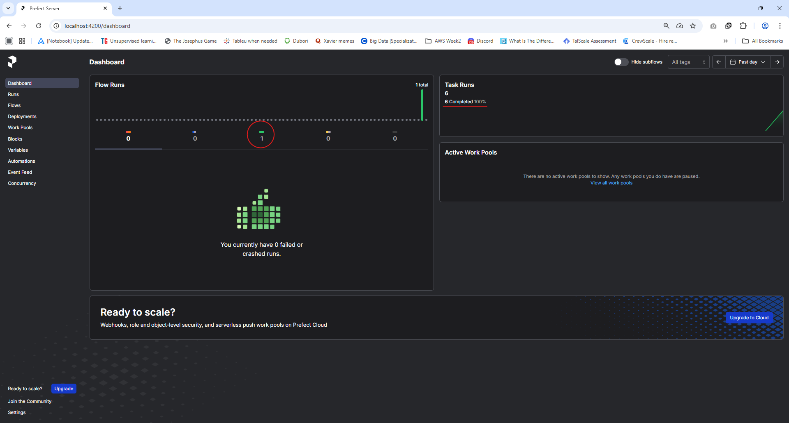   | 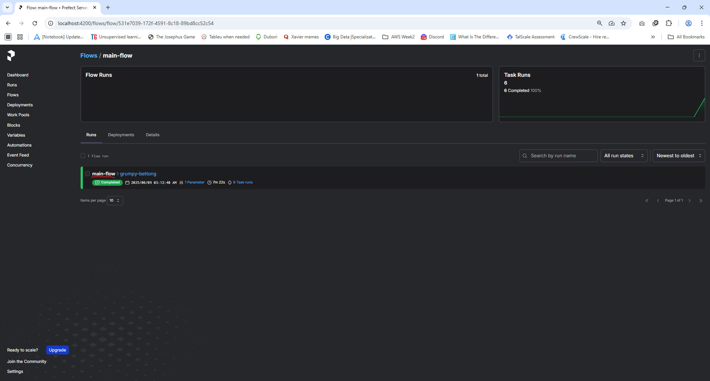 | 


 |                                         |                                         |
 |-----------------------------------------|-----------------------------------------|
 |   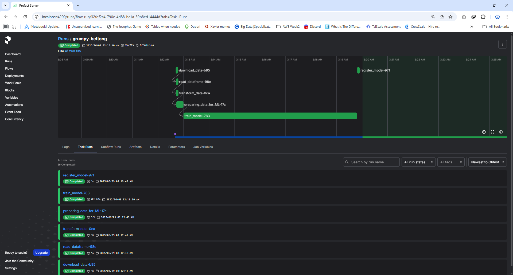   | 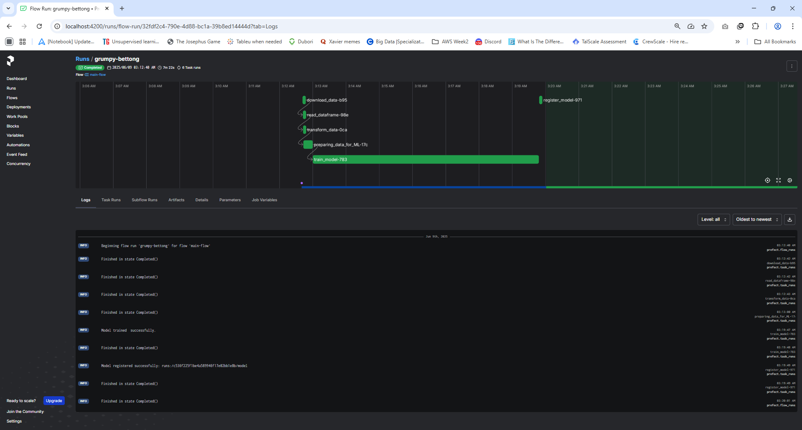 | 


## P.S. : While working with this assignment I ran into Out of Memory Error 

 ### I was on a EC2 instance with 16GB RAM, and I could have easily added another 16GB to it. But refrained from doing so as I wanted to see what could have been done in a local machine/laptop and set to find out alternatives. Now the EC2 instance had 30GB storage (in a local setup we would usually have half to one TB, so we can spare storage). So I decided to add 20 GB staorage to the EC2 compute instance making it 50 GB out of which I made a 30 GB swap file!! ###

 |                                  |                                 |
 |----------------------------------|---------------------------------|
 |   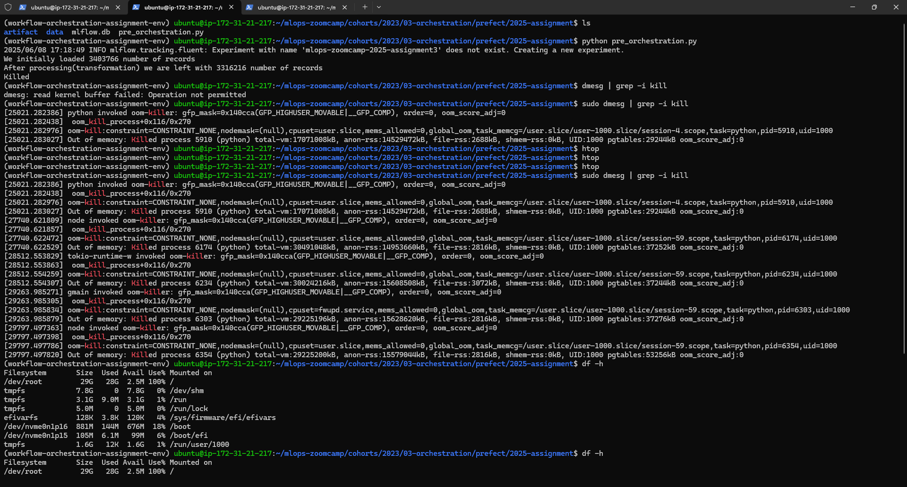 |  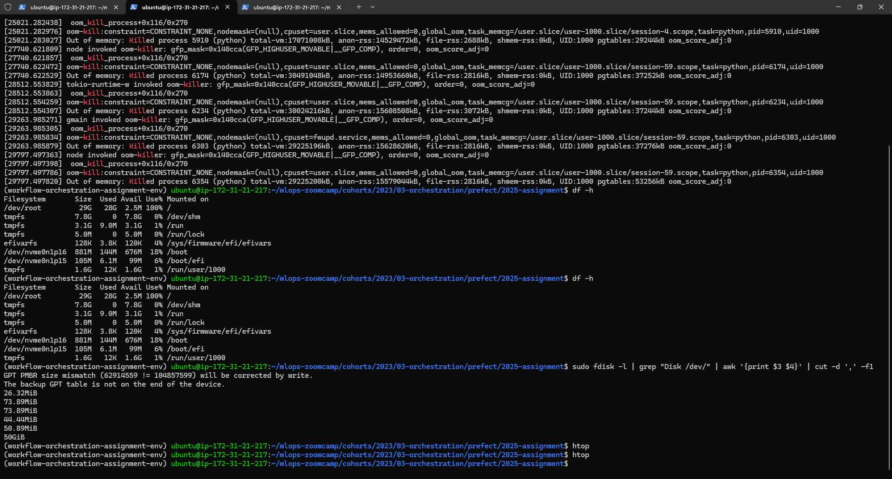 | 


 ### With that and other measures (mentioned at [__FAQ__](https://docs.google.com/document/d/12TlBfhIiKtyBv8RnsoJR6F72bkPDGEvPOItJIxaEzE0/edit?tab=t.0#heading=h.5fyavk64e3fk) ), I ran the pipeline (without Prefect) and found out that the run consumes maximum 13 GB of swap file (16GB RAM already 100% consumed!) to successfully complete. So replaced the swap file with a 16GB one to save space.

 ### Next I executed the same tasks of the pipeline in a workflow with Prefect (still continuing with experiment tracking through MLflow) and the 16GB swap file also made possible the execution of the flow.